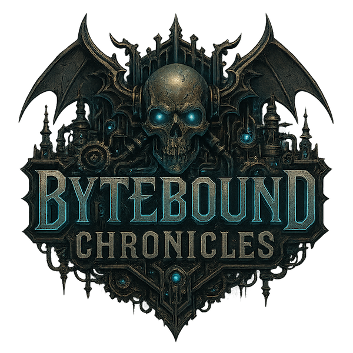

# Chronicles

A Terminal LLM Adventure Game engine with intelligent AI orchestration.

## Overview

Bytebound Chronicles is an interactive terminal-based adventure game engine that uses multiple AI models to create dynamic, engaging narratives. The game features intelligent AI model selection, spoiler-free story management, and real-time gameplay through WebSocket connections.

## Key Features

- **Intelligent AI Orchestration**: Role-based model selection with automatic frustration detection
- **Multi-Model Integration**: Google Gemini 2.5 + Claude 4 for optimal performance and empathy
- **Professional Prompt System**: Handlebars templating with context-aware generation
- **Spoiler-Free Story Loading**: Progressive story revelation without spoilers
- **Real-Time Gameplay**: WebSocket-based communication for live updates
- **Hybrid Database System**: LMDB + SQLite + Turso for optimal performance
- **Terminal UI**: Rich terminal experience built with React Ink

## Architecture

- **API-First Design**: Separation of game logic from interface
- **Role-Based AI Models**: `PRIMARY_NARRATIVE`, `FAST_INTENT`, `EMPATHETIC_ESCALATION`, `CREATIVE_ESCALATION`
- **Intelligent Escalation**: Automatic frustration detection with empathetic model switching
- **Professional Prompt System**: Handlebars templates with custom helpers for context injection
- **Progressive Story Loading**: Just-in-time content loading based on player progress
- **Hybrid Database Strategy**: LMDB for high-frequency data, SQLite for structured queries
- **Cross-Device Sync**: Optional cloud synchronization with Turso

## Technology Stack

- **Backend**: Node.js, TypeScript, Fastify
- **Database**: LMDB, SQLite, Turso
- **Frontend**: React Ink, WebSocket
- **AI**: Google Gemini, Anthropic Claude
- **Testing**: Vitest, Supertest

## Development Status

✅ **Phase 1 Complete: Foundation & Database Layer** 
- TypeScript project structure with comprehensive type system
- Hybrid database architecture (LMDB + SQLite) 
- Core game types and Zod validation schemas
- Player profile and game save management
- Real-time session tracking and analytics
- Comprehensive unit test suite

✅ **Phase 2 Complete: AI Orchestration System**
- Multi-model AI integration (Gemini 2.5 Pro/Flash, Claude 4 Opus/Sonnet)
- Role-based model architecture with intelligent selection
- Frustration detection with automatic empathetic escalation
- Professional prompt templating using Handlebars
- Comprehensive type safety with Zod response validation

✅ **Phase 2.5 Complete: Universal Game Schema**
- Comprehensive JSON schema supporting all game styles (RPG, Horror, Heist, Time-Loop, etc.)
- Complete TypeScript types and runtime validation with Zod
- CLI validation tools and developer utilities
- Example games demonstrating different genres and mechanics
- Migration guide from MVP to production schema

✅ **Phase 3 Complete: Story Management System**
- Progressive story loading with spoiler prevention
- Story metadata service with intelligent caching
- Comprehensive story validation with quality scoring
- Complete game session lifecycle management
- Real-time session updates and player action processing

See [`TODO.md`](./TODO.md) for detailed development roadmap and [`terminal_adventure_mvp_spec.md`](./terminal_adventure_mvp_spec.md) for the complete technical specification.

## Getting Started

**Prerequisites:**
- Node.js 20+
- npm or pnpm

**Setup:**

```bash
# Clone and setup
git clone https://github.com/nibzard/bytebound-chronicles.git
cd bytebound-chronicles
npm install

# Initialize databases
npm run setup-db

# Development
npm run dev:all    # Start both API and client
npm run dev        # API server only
npm run dev:client # Terminal client only

# Testing
npm test           # All tests
npm run test:unit  # Unit tests only
npm run typecheck  # TypeScript validation
npm run lint       # Code quality check
```

**Current Implementation Status:**
- ✅ Database layer with hybrid LMDB/SQLite architecture
- ✅ Core type system and validation schemas  
- ✅ Player management and game save system
- ✅ Multi-model AI orchestration with intelligent escalation
- ✅ Professional prompt templating and response validation
- ✅ Universal game schema with TypeScript types and validation
- ✅ Complete story management system with spoiler prevention
- ✅ Game session service with real-time updates
- ⏳ API endpoints and WebSocket integration
- ⏳ Terminal client interface

**Overall Progress: 40% Complete (3 of 8 phases)**

## Universal Game Schema

The project now includes a comprehensive universal JSON schema that supports multiple game styles within the Bytebound Chronicles engine:

### Supported Game Styles
- **RPG Fantasy**: Traditional role-playing adventures with stats and character progression
- **Horror**: Atmospheric horror experiences with sanity and fear mechanics
- **Heist**: Strategic crime scenarios with reputation and crew dynamics
- **Time-Loop**: Temporal mechanics with knowledge accumulation across resets
- **Romance**: Character relationship focus with emotional stat tracking
- **Sci-Fi**: Science fiction settings with technology and faction systems

### Schema Features
- **Hidden Mechanics Engine**: Invisible stat tracking that drives narrative adaptation
- **AI-Driven Storytelling**: Comprehensive AI guidance for consistent behavior
- **Player Agency**: Both structured quick actions and free-form creative input
- **Progressive Content**: Spoiler-free story revelation based on player progress
- **Type Safety**: Complete TypeScript types with runtime Zod validation
- **CLI Validation**: Developer tools for game quality assurance

### Schema Files
- [`bytebound-schema-v1.json`](./bytebound-schema-v1.json) - Main universal schema definition
- [`src/validation/game-schema-types.ts`](./src/validation/game-schema-types.ts) - TypeScript type definitions
- [`src/validation/game-schema-validator.ts`](./src/validation/game-schema-validator.ts) - Zod runtime validation
- [`MVP_SCHEMA_MIGRATION.md`](./MVP_SCHEMA_MIGRATION.md) - Migration guide from MVP format
- [`examples/`](./examples/) - Example games demonstrating different genres

## Documentation

- [`CLAUDE.md`](./CLAUDE.md) - Development guidance and architecture overview
- [`terminal_adventure_mvp_spec.md`](./terminal_adventure_mvp_spec.md) - Complete technical specification

## License

This project is comprised of two main parts, each with its own license:

- **Source Code**: The source code of the game engine and associated tools is licensed under the **MIT License**. See the [LICENSE](./LICENSE) file in the root directory for more details.

- **Story Content**: The story content, including all narratives, characters, and other creative works located in the `stories/` directory, is proprietary and protected by copyright. See the [LICENSE](./stories/LICENSE) file in the `stories/` directory for more details.
